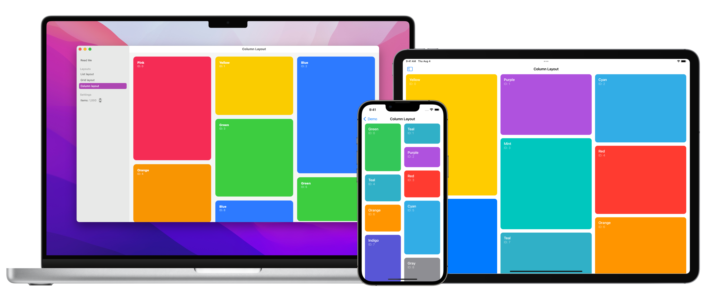

# LazyCollectionView

[](https://github.com/apple/swift-package-manager)


A modest attempt to port UICollectionView to SwiftUI.




## Table of Contents
- [Description](#description)
- [Requirements](#requirements)
- [Installation](#installation)
- [Usage](#usage)
- [Components](#components)
- [Improvements](#Improvements)
- [License](#license)

## Description
The goal of this component is to bring the flexibility of UIKit's `UICollectionView` to SwiftUI, especially for custom layouts. It is easily embeddable in a `ScrollView` and supports lazy loading its content like `LazyVStack`.

It is used in the Unsplash for iOS app to display a list of photos in a column layout. It also works on macOS but has not been thoroughly tested on the platform.

It is best suited to display a large number of items that would benefit from lazy loading in a `ScrollView`. Otherwise, the Layout API introduced in iOS 16 and macOS 13 is a better option.

Improvements and more sample layouts are welcome!

⚠️ The list and grid layouts in the sample project are just examples and should not be used outside of it. You should instead use `LazyVStack` and `LazyVGrid`, respectively.


## Requirements
- iOS 14+
- macOS 12+
- Xcode 13.4+
- Swift 5.6+


## Installation
LazyCollectionView is available through [Swift Package Manager](https://swift.org/package-manager/). To install it, follow these steps:

1. In Xcode, click File, then Swift Package Manager, then Add Package Dependency
2. Choose your project
3. Enter this URL in the search bar `https://github.com/unsplash/swiftui-lazycollectionview.git`


## Usage
The first step is to create a layout object, which is a class that adopts the `LazyCollectionLayout` and `ObservableObject` protocols. This object is in charge of generating the frame for all the views in LazyCollectionView. The layouts in the sample project can be used as a reference.

Here is the typical way to use LazyCollectionView.

```swift
GeometryReader { geometryProxy in
    let parentFrame = geometryProxy.frame(in: .local)
	
    ScrollView {
        LazyCollectionView(data: myArray,
                           layout: myCustomLayout,
                           parentFrame: parentFrame) { item in
            ItemView(item)
        }
    }
}
```

For lazy-loading to work, it is important to set a value for the `parentFrame` property.

Note that unlike `UICollectionView`, LazyCollectionView does not add its subviews inside a scroll view. This makes it easy to mix it with other views (headers, footers and more) inside a parent scroll view.


## Components

### 1. LazyCollectionView
A view that presents an ordered collection of data items using a customizable layout.

#### Parameters
- `data`:	The identified data that the LazyCollectionView instance uses to create views dynamically.
- `layout`: The layout object that calculates the positions of the views.
- `parentFrame` _(Optional)_: The frame of the instance's parent view.
- `content`: The view builder that creates views dynamically.

### 2. LazyCollectionLayout
A type that calculates how the items in a lazy collection view are laid out.

### 3. LazyCollectionLayoutAttributes
A layout object that holds the layout-related attributes for a given item in a LazyCollectionView. It is created by an instance of `LazyCollectionViewLayout` and used by `LazyCollectionView` to lay out its content.


## Improvements
Here's a short list of potential improvements.

- Add support to update the layout granularly (when adding/inserting a new element or deleting an element from the data).  Recalculating the whole layout when adding new elements is not good.
- If possible, find a way to get rid of the `parentFrame` parameter because it adds complexity to the usage.


## License
MIT License

Copyright (c) 2022 Unsplash Inc.

Permission is hereby granted, free of charge, to any person obtaining a copy of this software and associated documentation files (the "Software"), to deal in the Software without restriction, including without limitation the rights to use, copy, modify, merge, publish, distribute, sublicense, and/or sell copies of the Software, and to permit persons to whom the Software is furnished to do so, subject to the following conditions:

The above copyright notice and this permission notice shall be included in all copies or substantial portions of the Software.

THE SOFTWARE IS PROVIDED "AS IS", WITHOUT WARRANTY OF ANY KIND, EXPRESS OR IMPLIED, INCLUDING BUT NOT LIMITED TO THE WARRANTIES OF MERCHANTABILITY, FITNESS FOR A PARTICULAR PURPOSE AND NONINFRINGEMENT. IN NO EVENT SHALL THE AUTHORS OR COPYRIGHT HOLDERS BE LIABLE FOR ANY CLAIM, DAMAGES OR OTHER LIABILITY, WHETHER IN AN ACTION OF CONTRACT, TORT OR OTHERWISE, ARISING FROM, OUT OF OR IN CONNECTION WITH THE SOFTWARE OR THE USE OR OTHER DEALINGS IN THE SOFTWARE.
